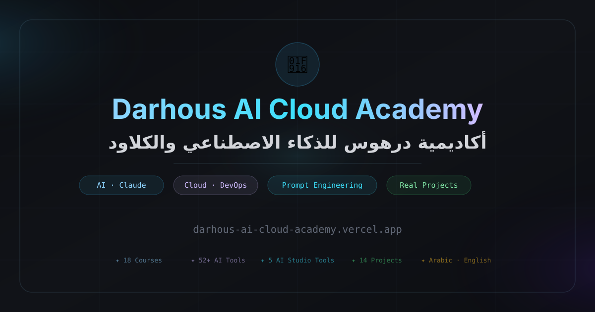

<div align="center">



<br />

# Darhous AI Cloud Academy

### أكاديمية درهوس للذكاء الاصطناعي والكلاود

**Arabic-first bilingual learning ecosystem for AI, cloud, automation, digital skills, career development, language assessment, IoT, tools, projects, and certificates.**

<br />

[](#-العربية)
[](#-english)

<br />

[](https://darhous-ai-cloud-academy.vercel.app)
[](https://darhous-ai-cloud-academy.vercel.app/ar)
[](https://darhous-ai-cloud-academy.vercel.app/en)

<br />

[](https://nextjs.org/)
[](https://react.dev/)
[](https://www.typescriptlang.org/)
[](https://tailwindcss.com/)
[](https://supabase.com/)
[](https://vercel.com/)

</div>

---

# 🇦🇪 العربية

<div dir="rtl" align="right">

## منصة واحدة. عدة بوابات تعليمية.

**أكاديمية درهوس للذكاء الاصطناعي والكلاود** هي منصة تعليمية رقمية عربية أولًا وثنائية اللغة، تجمع بين التعلم المنظم، المعامل العملية، أدوات الذكاء الاصطناعي، الاختبارات، المشاريع التطبيقية، تتبع التقدم، الشهادات، ولوحات الإدارة داخل تجربة واحدة مترابطة.

الهدف من المنصة هو مساعدة المتعلم على الانتقال من **فهم المفاهيم** إلى **بناء مهارات عملية قابلة للتطبيق** في مجالات الذكاء الاصطناعي، الكلاود، الأتمتة، التحول الرقمي، إنترنت الأشياء، وتطوير المسار المهني.

<table>
  <tr>
    <td width="33%" valign="top">
      <h3>🤖 بوابة الذكاء الاصطناعي</h3>
      <p>دورات AI، هندسة البرومبت، أدوات ذكية، معامل تطبيقية، مشاريع، تحديات، ومرشد ذكي للتعلم.</p>
      <a href="https://darhous-ai-cloud-academy.vercel.app/ar/ai-academy">ادخل البوابة ←</a>
    </td>
    <td width="33%" valign="top">
      <h3>🌐 بوابة اللغة</h3>
      <p>اختبار مستوى اللغة الإنجليزية، تقييم المهارات، نتائج فورية، سجل المحاولات، وتوصيات تعليمية.</p>
      <a href="https://darhous-ai-cloud-academy.vercel.app/ar/language">اختبر مستواك ←</a>
    </td>
    <td width="33%" valign="top">
      <h3>💻 الاختبارات الرقمية</h3>
      <p>اختبارات في تكنولوجيا المعلومات، Microsoft Office، الأمن السيبراني، ومهارات التحول الرقمي الأساسية.</p>
      <a href="https://darhous-ai-cloud-academy.vercel.app/ar/digital-exams">ابدأ اختبارًا ←</a>
    </td>
  </tr>
  <tr>
    <td width="33%" valign="top">
      <h3>💼 مركز المسار المهني</h3>
      <p>تحليل السيرة الذاتية بالذكاء الاصطناعي، ATS scoring، بناء CV، مطابقة فرص، وتحضير للمقابلات.</p>
      <a href="https://darhous-ai-cloud-academy.vercel.app/ar/career">طوّر مسارك ←</a>
    </td>
    <td width="33%" valign="top">
      <h3>⚙️ أكاديمية الأتمتة</h3>
      <p>مسارات تعلم الأتمتة، وصفات workflows، معامل عملية، وقوالب تساعد على بناء حلول أتمتة حقيقية.</p>
      <a href="https://darhous-ai-cloud-academy.vercel.app/ar/automation">استكشف الأتمتة ←</a>
    </td>
    <td width="33%" valign="top">
      <h3>🔌 معمل IoT و Arduino</h3>
      <p>دروس Arduino، مشاريع تطبيقية، تحديات برمجية، مراجع للمكونات، وتجربة تعلم موجهة بالمحاكاة.</p>
      <a href="https://darhous-ai-cloud-academy.vercel.app/ar/iot-lab">ادخل المعمل ←</a>
    </td>
  </tr>
</table>

---

## أهم مميزات المنصة

| المجال                              | ما تقدمه المنصة                                                                                  |
| ----------------------------------- | ------------------------------------------------------------------------------------------------ |
| **🌍 العربية والإنجليزية**          | تجربة عربية RTL وإنجليزية LTR مع دعم تعدد اللغات في المسارات والصفحات                            |
| **🧠 مساحة تعلم بالذكاء الاصطناعي** | AI Mentor، Prompt Studio، Prompt Score، Tool Recommender، Roadmap Generator، و Project Generator |
| **📚 تعليم منظم**                   | دورات، دروس، مسارات، تحديات، مشاريع، مدونة، قاموس تقني، ومعامل عملية                             |
| **🧪 نظام اختبارات**                | اختبار لغة، اختبارات رقمية، اختبارات مختلطة، سجل نتائج، وتوضيح للإجابات                          |
| **💼 ذكاء مهني**                    | تحليل CV، أدوات ATS، تدريب مقابلات، قوالب، وتوجيه للمسار الوظيفي                                 |
| **👤 هوية المتعلم**                 | تسجيل دخول، onboarding، ملف شخصي، dashboard، تقدم، صفحات عامة، ولوحات ترتيب                      |
| **🏅 إثبات الإنجاز**                | إصدار شهادات، معاينة الشهادات، صفحات تحقق عامة، وربط الشهادات بالبوابات                          |
| **🔎 اكتشاف المحتوى**               | بحث، تصنيفات، أدوات، مقارنات، مفضلة، ومصادر محفوظة                                               |
| **🎨 تجربة استخدام حديثة**          | تصميم Digital Depth، هوية ألوان لكل بوابة، motion، glassmorphism، ودعم reduced motion            |
| **🛠️ إدارة محتوى**                 | CMS مبني على Supabase لإدارة محتوى المنصة بشكل تدريجي وآمن                                       |

---

## AI Studio

تضم الأكاديمية مجموعة أدوات ذكاء اصطناعي مركزة للتعلم والبناء والتقييم، بدل الاعتماد على واجهة دردشة عامة فقط.

| الأداة                    | المسار                            | الهدف                                             |
| ------------------------- | --------------------------------- | ------------------------------------------------- |
| **AI Mentor**             | `/[locale]/mentor`                | مرشد ذكي يساعد المتعلم داخل الأكاديمية            |
| **Prompt Studio**         | `/[locale]/prompt-studio`         | تحسين البرومبت وتنظيمه للحصول على نتائج أقوى      |
| **Prompt Score**          | `/[locale]/prompt-score`          | تقييم جودة البرومبت وتحديد نقاط التحسين           |
| **Prompt Battle**         | `/[locale]/prompt-battle`         | تدريب تفاعلي على هندسة البرومبت                   |
| **Claude Code Generator** | `/[locale]/claude-code-generator` | إنشاء برومبتات تفصيلية لاستخدامها في مهام البرمجة |
| **Tool Recommender**      | `/[locale]/tool-recommender`      | ترشيح أدوات مناسبة حسب هدف المتعلم                |
| **Roadmap Generator**     | `/[locale]/roadmap-generator`     | إنشاء خارطة تعلم شخصية                            |
| **Project Generator**     | `/[locale]/project-generator`     | تحويل الأفكار إلى مشاريع منظمة قابلة للبناء       |

---

## المحتوى ونظام الاكتشاف

تتحول المنصة تدريجيًا من محتوى ثابت إلى نظام إدارة محتوى مبني على Supabase، مع الحفاظ على fallback آمن من الملفات الثابتة حتى لا تتعطل الصفحات العامة.

| نوع المحتوى           | المسار               | الحالة                                           |
| --------------------- | -------------------- | ------------------------------------------------ |
| **📘 الدورات**        | `/[locale]/courses`  | CMS مرتبط بقاعدة البيانات مع static fallback     |
| **🧩 المشاريع**       | `/[locale]/projects` | CMS مرتبط بقاعدة البيانات مع hybrid JSONB schema |
| **🛠️ الأدوات**       | `/[locale]/tools`    | CMS مع إدارة كاملة من لوحة الإدارة               |
| **💬 البرومبتات**     | `/[locale]/prompts`  | مكتبة برومبتات قابلة للإدارة                     |
| **📖 القاموس التقني** | `/[locale]/glossary` | قاموس تقني قابل للإدارة من لوحة الإدارة          |

يعتمد نظام المحتوى على:

* محتوى منشور للزوار
* حالات draft و archived لسير عمل الإدارة
* fallback ثابت لحماية الإنتاج
* أشكال بيانات قابلة لإعادة الاستخدام
* ترحيل تدريجي من الملفات الثابتة إلى قاعدة البيانات بدون كسر المسارات

---

## قدرات الإدارة و CMS

تحتوي المنصة على طبقة إدارة لإدارة المحتوى والعمليات الأساسية.

| القدرة                    | الهدف                                                           |
| ------------------------- | --------------------------------------------------------------- |
| **إدارة المحتوى**         | إدارة القاموس، الأدوات، البرومبتات، الدورات، والمشاريع          |
| **Admin CRUD APIs**       | إنشاء، تعديل، نشر، أرشفة، وحذف المحتوى المدعوم                  |
| **Supabase Service Role** | عمليات إدارية آمنة من الخادم فقط                                |
| **التحكم في الصلاحيات**   | عمليات الكتابة للإدارة فقط، والقراءة العامة للمحتوى المنشور فقط |
| **Content fallback**      | استمرار الصفحات العامة حتى عند عدم توفر قاعدة البيانات          |
| **إعدادات المنصة**        | إدارة إعدادات وخصائص مختارة من مكان مركزي                       |

---

## نظام التصميم

يعتمد التصميم الحالي على اتجاه **Digital Depth** المناسب لمنصة EdTech عربية احترافية.

| الطبقة                 | الوصف                                                               |
| ---------------------- | ------------------------------------------------------------------- |
| **هوية لكل بوابة**     | كل بوابة لها لون وهوية من خلال CSS variables و `data-portal`        |
| **أسطح Glassmorphism** | واجهة داكنة احترافية بحدود ناعمة وعمق بصري واضح                     |
| **نظام حركة**          | انتقالات، micro-interactions، progress motion، وتأثيرات hover/focus |
| **اهتمام بالإتاحة**    | reduced-motion، حالات focus، skip link، وتجربة responsive           |
| **واجهة موحدة**        | Navbar، Footer، wrappers، وإيقاع بصري ثابت عبر المنصة               |

---

## نظرة على المعمارية

```text
src/
├── app/
│   ├── [locale]/                 # صفحات المنصة حسب اللغة
│   ├── api/                      # APIs للذكاء الاصطناعي، الاختبارات، التقدم، المحتوى، والإدارة
│   ├── certificates/             # التحقق العام من الشهادات
│   ├── og/                       # صور Open Graph الديناميكية
│   ├── sitemap.ts
│   └── robots.ts
├── components/
│   ├── admin/                    # مكونات لوحة الإدارة و CMS
│   ├── cards/                    # كروت الدورات والأدوات والمشاريع والمحتوى
│   ├── features/                 # مكونات المميزات والبوابات
│   ├── layout/                   # Navbar و Footer و Shell والتنقل
│   └── ui/                       # مكونات واجهة مشتركة
├── config/                       # إعدادات المنصة والبوابات
├── data/                         # محتوى ثابت كـ fallback
├── hooks/                        # سلوكيات العميل وحالة المستخدم
├── lib/
│   ├── auth/                     # أدوات المصادقة والإدارة
│   ├── content/                  # تحميل المحتوى من DB مع static fallback
│   ├── supabase/                 # عملاء Supabase وأدواته
│   └── services/                 # خدمات وتكاملات مشتركة
└── messages/                     # ترجمات العربية والإنجليزية
```

---

## التقنيات المستخدمة

| المجال            | التقنية                                                            |
| ----------------- | ------------------------------------------------------------------ |
| **Framework**     | Next.js 16.2, React 19.2                                           |
| **Language**      | TypeScript 5                                                       |
| **Styling**       | Tailwind CSS 4, CSS variables, `tailwind-merge`, `clsx`            |
| **Motion & UI**   | Framer Motion, Lucide React, React Icons                           |
| **Data & Auth**   | Supabase SSR و Supabase JS                                         |
| **Content**       | MDX Remote, Gray Matter, Static fallback data, Supabase CMS tables |
| **Search**        | Fuse.js                                                            |
| **Visualization** | Recharts                                                           |
| **Documents**     | React PDF, PDF parsing, QR codes                                   |
| **Email**         | Resend                                                             |
| **Deployment**    | Vercel                                                             |

---

## جداول محتوى Supabase

ملفات migrations الخاصة بالـ CMS موجودة داخل مجلد `supabase/`.

```text
supabase/
├── v22_ai_glossary.sql
├── v23_ai_tools.sql
├── v24_ai_prompts.sql
├── v25_ai_courses.sql
└── v26_ai_projects.sql
```

تعتمد جداول الـ CMS على نمط إنتاج آمن:

* قراءة عامة للمحتوى المنشور فقط
* عمليات إنشاء وتعديل وأرشفة وحذف للإدارة فقط
* دعم حالات draft و published و archived
* حقول زمنية للإنشاء والتحديث والنشر والأرشفة
* arrays للوسوم والأدوات والمهارات والبيانات المرتبطة
* JSONB للبنى المتداخلة مثل خطوات المشاريع، الاختبارات، ومحتوى الدروس

---

## التشغيل محليًا

### المتطلبات

* Node.js متوافق مع Next.js 16
* npm
* بيانات Supabase للـ auth وقاعدة البيانات
* مفاتيح مزود الذكاء الاصطناعي للميزات الذكية عند الحاجة

### خطوات التشغيل

```bash
git clone https://github.com/Darhous/darhous-ai-cloud-academy.git
cd darhous-ai-cloud-academy
npm install
copy .env.example .env.local
npm run dev
```

على macOS أو Linux:

```bash
cp .env.example .env.local
npm run dev
```

افتح:

```text
http://localhost:3000
```

> احتفظ ببيانات الاعتماد داخل `.env.local`. لا ترفع ملفات البيئة أو المفاتيح الخاصة إلى GitHub.

---

## أوامر المشروع

| الأمر               | الوصف                               |
| ------------------- | ----------------------------------- |
| `npm run dev`       | تشغيل خادم التطوير                  |
| `npm run build`     | بناء نسخة الإنتاج                   |
| `npm run start`     | تشغيل نسخة الإنتاج                  |
| `npm run lint`      | تشغيل ESLint                        |
| `npm run typecheck` | فحص TypeScript بدون إخراج ملفات     |
| `npm run check`     | تشغيل lint و typecheck و build معًا |

---

## أهم المسارات

```text
/{locale}                              الصفحة الرئيسية
/{locale}/ai-academy                   بوابة الذكاء الاصطناعي
/{locale}/language                     بوابة اختبار اللغة
/{locale}/digital-exams                بوابة الاختبارات الرقمية
/{locale}/career                       مركز المسار المهني
/{locale}/automation                   أكاديمية الأتمتة
/{locale}/iot-lab                      معمل IoT و Arduino

/{locale}/courses                      كتالوج الدورات
/{locale}/courses/[slug]               تفاصيل الدورة
/{locale}/courses/[slug]/lessons/[n]   صفحات دروس الدورة

/{locale}/projects                     مكتبة المشاريع التطبيقية
/{locale}/projects/[slug]              تفاصيل المشروع
/{locale}/projects/[slug]/build        دليل بناء المشروع

/{locale}/tools                        دليل أدوات الذكاء الاصطناعي
/{locale}/tools/[slug]                 تفاصيل الأداة
/{locale}/prompts                      مكتبة البرومبتات
/{locale}/glossary                     القاموس التقني

/{locale}/mentor                       AI Mentor
/{locale}/prompt-studio                Prompt Studio
/{locale}/prompt-score                 Prompt Score
/{locale}/prompt-battle                Prompt Battle
/{locale}/claude-code-generator        Claude Code prompt generator
/{locale}/tool-recommender             AI tool recommender
/{locale}/roadmap-generator            Learning roadmap generator
/{locale}/project-generator            Project generator

/{locale}/dashboard                    لوحة المتعلم
/{locale}/certificates                 شهادات المتعلم
/{locale}/leaderboard                  لوحة الترتيب
```

استخدم `ar` أو `en` مكان `[locale]`.

---

## فحص الجودة

قبل فتح Pull Request أو إنهاء Phase كبيرة، شغّل:

```bash
npm run check
```

للفحص الجزئي:

```bash
npm run lint
npm run typecheck
npm run build
```

---

## التوثيق

| الملف                                                  | الهدف                             |
| ------------------------------------------------------ | --------------------------------- |
| [`DEVELOPMENT_GUIDE.md`](./DEVELOPMENT_GUIDE.md)       | إعداد بيئة التطوير وسير العمل     |
| [`CONTENT_ARCHITECTURE.md`](./CONTENT_ARCHITECTURE.md) | نماذج المحتوى ومعمارية البيانات   |
| [`PLATFORM_BLUEPRINT.md`](./PLATFORM_BLUEPRINT.md)     | هيكل المنتج واتجاه المنصة         |
| [`DEPLOYMENT_GUIDE.md`](./DEPLOYMENT_GUIDE.md)         | النشر والإعدادات الإنتاجية        |
| [`SUPABASE_SETUP.md`](./SUPABASE_SETUP.md)             | إعداد Supabase                    |
| [`ADMIN_GUIDE.md`](./ADMIN_GUIDE.md)                   | خصائص الإدارة وسير العمل          |
| [`FUTURE_ROADMAP.md`](./FUTURE_ROADMAP.md)             | خطة التطوير المستقبلية            |
| [`GITHUB_RELEASE_GUIDE.md`](./GITHUB_RELEASE_GUIDE.md) | releases و checkpoints على GitHub |
| [`RAG_MENTOR_PLAN.md`](./RAG_MENTOR_PLAN.md)           | خطة مستقبلية لمعرفة المرشد الذكي  |
| [`SECURITY.md`](./SECURITY.md)                         | سياسة الأمان والإبلاغ             |

---

## النشر

المنصة منشورة على Vercel:

### [darhous-ai-cloud-academy.vercel.app](https://darhous-ai-cloud-academy.vercel.app)

لمزيد من التفاصيل، راجع [`DEPLOYMENT_GUIDE.md`](./DEPLOYMENT_GUIDE.md).

---

## ملاحظات الأمان

* احتفظ بملف `.env.local` خاصًا.
* لا تعرض `SUPABASE_SERVICE_ROLE_KEY` في المتصفح.
* لا تضع مفاتيح server-only داخل متغيرات `NEXT_PUBLIC_`.
* يجب أن تعرض الصفحات العامة المحتوى المنشور فقط.
* يجب أن تتحقق Admin APIs من صلاحية المدير من الخادم.
* يجب إبقاء RLS مفعّلًا على جداول المحتوى.
* لا ترفع credentials أو tokens أو مفاتيح خدمة إلى GitHub.

</div>

---

# 🇬🇧 English

## One Ecosystem. Multiple Learning Portals.

**Darhous AI Cloud Academy** is an Arabic-first bilingual digital learning platform that brings structured education, practical labs, AI tools, assessments, applied projects, learner progress, certificates, and admin-managed content into one connected experience.

The platform helps learners move from **understanding concepts** to **building practical skills** across AI, cloud, automation, digital transformation, IoT, and career development.

<table>
  <tr>
    <td width="33%" valign="top">
      <h3>🤖 AI Academy</h3>
      <p>AI courses, prompt engineering, intelligent labs, practical projects, challenges, and AI mentor support.</p>
      <a href="https://darhous-ai-cloud-academy.vercel.app/en/ai-academy">Enter portal →</a>
    </td>
    <td width="33%" valign="top">
      <h3>🌐 Language Portal</h3>
      <p>English level assessment, skill evaluation, instant results, learning history, and recommendations.</p>
      <a href="https://darhous-ai-cloud-academy.vercel.app/en/language">Test your level →</a>
    </td>
    <td width="33%" valign="top">
      <h3>💻 Digital Exams</h3>
      <p>Assessments for IT, Microsoft Office, cybersecurity, and essential digital transformation skills.</p>
      <a href="https://darhous-ai-cloud-academy.vercel.app/en/digital-exams">Start an exam →</a>
    </td>
  </tr>
  <tr>
    <td width="33%" valign="top">
      <h3>💼 Career Hub</h3>
      <p>AI-powered CV analysis, ATS scoring, CV building, job matching, and interview preparation.</p>
      <a href="https://darhous-ai-cloud-academy.vercel.app/en/career">Build your career →</a>
    </td>
    <td width="33%" valign="top">
      <h3>⚙️ Automation Academy</h3>
      <p>Business automation learning paths, curated workflow recipes, practical labs, and workflow guidance.</p>
      <a href="https://darhous-ai-cloud-academy.vercel.app/en/automation">Explore automation →</a>
    </td>
    <td width="33%" valign="top">
      <h3>🔌 IoT & Arduino Lab</h3>
      <p>Arduino lessons, applied projects, coding challenges, component references, and simulator-oriented learning.</p>
      <a href="https://darhous-ai-cloud-academy.vercel.app/en/iot-lab">Enter the lab →</a>
    </td>
  </tr>
</table>

---

## Platform Highlights

| Area                         | What it delivers                                                                                              |
| ---------------------------- | ------------------------------------------------------------------------------------------------------------- |
| **🌍 Arabic + English**      | Locale-aware Arabic RTL and English LTR experiences across the platform                                       |
| **🧠 AI learning workspace** | AI mentor, prompt studio, prompt scoring, tool recommendations, project generation, and personalized roadmaps |
| **📚 Structured education**  | Courses, lessons, paths, challenges, glossaries, blogs, projects, and hands-on labs                           |
| **🧪 Assessment engine**     | Language assessment, digital exams, mixed exams, result history, and explanation workflows                    |
| **💼 Career intelligence**   | CV analysis, ATS-oriented tooling, interview practice, templates, and career exploration                      |
| **👤 Learner identity**      | Authentication, onboarding, profiles, dashboard, public profile pages, progress, and leaderboards             |
| **🏅 Proof of achievement**  | Certificate issuing, previews, verification pages, and portal-specific certificate workflows                  |
| **🔎 Discovery at scale**    | Search, categorized content, tool comparison, favorites, and saved learning resources                         |
| **🎨 Premium UX**            | Portal-aware design system, responsive UI, motion, glass surfaces, theme support, and PWA metadata            |
| **🛠️ Admin-ready content**  | Supabase-backed CMS architecture for managing core learning content safely                                    |

---

## AI Studio

The Academy includes focused AI experiences for learning, building, evaluation, and guidance instead of a single generic chat interface.

| Tool                      | Route                             | Purpose                                                    |
| ------------------------- | --------------------------------- | ---------------------------------------------------------- |
| **AI Mentor**             | `/[locale]/mentor`                | Context-aware academy guidance and learning support        |
| **Prompt Studio**         | `/[locale]/prompt-studio`         | Improve and structure prompts for stronger outputs         |
| **Prompt Score**          | `/[locale]/prompt-score`          | Evaluate prompt quality and identify improvements          |
| **Prompt Battle**         | `/[locale]/prompt-battle`         | Practice prompt engineering through interactive challenges |
| **Claude Code Generator** | `/[locale]/claude-code-generator` | Build detailed implementation prompts for coding workflows |
| **Tool Recommender**      | `/[locale]/tool-recommender`      | Match learner goals with suitable AI tools                 |
| **Roadmap Generator**     | `/[locale]/roadmap-generator`     | Generate personalized learning roadmaps                    |
| **Project Generator**     | `/[locale]/project-generator`     | Turn ideas into structured, buildable project plans        |

---

## Content & Discovery

The platform is gradually moving key content areas from static files into a Supabase-backed content management system while keeping safe static fallback rendering.

| Content Area    | Route                | Status                                   |
| --------------- | -------------------- | ---------------------------------------- |
| **📘 Courses**  | `/[locale]/courses`  | DB-backed CMS with static fallback       |
| **🧩 Projects** | `/[locale]/projects` | DB-backed CMS with hybrid JSONB schema   |
| **🛠️ Tools**   | `/[locale]/tools`    | DB-backed CMS with admin CRUD            |
| **💬 Prompts**  | `/[locale]/prompts`  | DB-backed prompt library with admin CRUD |
| **📖 Glossary** | `/[locale]/glossary` | DB-backed glossary with admin CRUD       |

The content strategy is designed around:

* published content for public visitors
* draft and archived states for admin workflows
* static fallback for production safety
* reusable content shapes across static and database sources
* gradual migration without breaking existing routes

---

## Admin & CMS Capabilities

Darhous AI Cloud Academy includes an admin layer for managing platform content and operational features.

| Capability                      | Purpose                                                                   |
| ------------------------------- | ------------------------------------------------------------------------- |
| **Content management**          | Manage glossary, tools, prompts, courses, and projects                    |
| **Admin CRUD APIs**             | Create, edit, archive, publish, and delete supported content              |
| **Supabase service role usage** | Server-side admin operations with protected credentials                   |
| **Role-aware access**           | Admin-only write operations and public-only published reads               |
| **Content fallback**            | Keep public pages available even when database content is unavailable     |
| **Platform settings**           | Centralized management for selected platform options and feature behavior |

---

## Design System

The current UI direction follows a premium **Digital Depth** style for an Arabic-first EdTech product.

| Layer                      | Description                                                                                  |
| -------------------------- | -------------------------------------------------------------------------------------------- |
| **Portal identity tokens** | Each portal has its own color identity through CSS variables and `data-portal` attributes    |
| **Glassmorphism surfaces** | Dark premium UI with soft borders, depth, gradients, and readable contrast                   |
| **Motion system**          | Scroll reveal, portal transitions, glowing states, progress movement, and micro-interactions |
| **Accessibility care**     | Reduced-motion support, focus states, skip link support, and responsive behavior             |
| **Consistent shell**       | Shared navigation, footer, portal wrappers, and platform-wide visual rhythm                  |

---

## Architecture at a Glance

```text
src/
├── app/
│   ├── [locale]/                 # Localized learner-facing portal routes
│   ├── api/                      # AI, assessment, progress, email, content, and admin APIs
│   ├── certificates/             # Public certificate verification
│   ├── og/                       # Dynamic Open Graph output
│   ├── sitemap.ts
│   └── robots.ts
├── components/
│   ├── admin/                    # Admin dashboard and CMS interfaces
│   ├── cards/                    # Course, tool, project, and content cards
│   ├── features/                 # Platform feature components
│   ├── layout/                   # Navbar, footer, shell, and navigation
│   └── ui/                       # Shared UI primitives
├── config/                       # Central platform and portal configuration
├── data/                         # Static fallback academy content
├── hooks/                        # Client-side behavior and persisted learner state
├── lib/
│   ├── auth/                     # Shared auth and admin helpers
│   ├── content/                  # DB-first content loading with static fallback
│   ├── supabase/                 # Supabase clients and utilities
│   └── services/                 # Shared services and integrations
└── messages/                     # Arabic and English translations
```

---

## Technology

| Area              | Technology                                                         |
| ----------------- | ------------------------------------------------------------------ |
| **Framework**     | Next.js 16.2, React 19.2                                           |
| **Language**      | TypeScript 5                                                       |
| **Styling**       | Tailwind CSS 4, CSS variables, `tailwind-merge`, `clsx`            |
| **Motion & UI**   | Framer Motion, Lucide React, React Icons                           |
| **Data & Auth**   | Supabase SSR and Supabase JS                                       |
| **Content**       | MDX Remote, Gray Matter, static fallback data, Supabase CMS tables |
| **Search**        | Fuse.js                                                            |
| **Visualization** | Recharts                                                           |
| **Documents**     | React PDF, PDF parsing, QR codes                                   |
| **Email**         | Resend                                                             |
| **Deployment**    | Vercel                                                             |

---

## Supabase Content Tables

CMS-related database migrations are stored under `supabase/`.

```text
supabase/
├── v22_ai_glossary.sql
├── v23_ai_tools.sql
├── v24_ai_prompts.sql
├── v25_ai_courses.sql
└── v26_ai_projects.sql
```

The CMS tables follow a safe production pattern:

* public reads only for published content
* admin-only create, update, archive, and delete workflows
* `status` support for draft, published, and archived content
* timestamps for creation, updates, publishing, and archiving
* structured arrays for tags, tools, skills, and related metadata
* JSONB support for nested lesson outlines, quizzes, project steps, and complex content blocks

---

## Getting Started

### Prerequisites

* Node.js compatible with Next.js 16
* npm
* Supabase project credentials for auth and database-backed features
* AI provider credentials for AI-powered tools where required

### Local Development

```bash
git clone https://github.com/Darhous/darhous-ai-cloud-academy.git
cd darhous-ai-cloud-academy
npm install
copy .env.example .env.local
npm run dev
```

For macOS or Linux:

```bash
cp .env.example .env.local
npm run dev
```

Open:

```text
http://localhost:3000
```

> Keep credentials in `.env.local`. Never commit local environment files or expose server-only keys through public environment variables.

---

## Environment Variables

Use `.env.example` as the starting point for local setup.

Common environment groups include:

| Variable Group            | Purpose                                                     |
| ------------------------- | ----------------------------------------------------------- |
| **Supabase public keys**  | Browser-safe project URL and anon key                       |
| **Supabase service role** | Server-only admin operations and protected APIs             |
| **AI provider keys**      | Server-side AI tools and mentor workflows                   |
| **Site URL**              | Metadata, redirects, Open Graph, and production links       |
| **Email provider keys**   | Transactional or notification email workflows where enabled |

Security rules:

* never commit `.env.local`
* never expose service-role keys in `NEXT_PUBLIC_` variables
* keep AI provider keys server-side
* verify admin APIs from the server before allowing write operations

---

## Available Scripts

| Command             | Description                                          |
| ------------------- | ---------------------------------------------------- |
| `npm run dev`       | Start the Next.js development server                 |
| `npm run build`     | Create a production build                            |
| `npm run start`     | Start the production server                          |
| `npm run lint`      | Run ESLint                                           |
| `npm run typecheck` | Run TypeScript without emitting files                |
| `npm run check`     | Run linting, type checking, and the production build |

---

## Key Routes

```text
/{locale}                              Platform home
/{locale}/ai-academy                   AI learning portal
/{locale}/language                     English assessment portal
/{locale}/digital-exams                Digital skills examination portal
/{locale}/career                       Career development hub
/{locale}/automation                   Automation academy
/{locale}/iot-lab                      IoT and Arduino learning lab

/{locale}/courses                      Course catalog
/{locale}/courses/[slug]               Course details
/{locale}/courses/[slug]/lessons/[n]   Course lesson pages

/{locale}/projects                     Applied project library
/{locale}/projects/[slug]              Project details
/{locale}/projects/[slug]/build        Project build guide

/{locale}/tools                        AI tools directory
/{locale}/tools/[slug]                 Tool details
/{locale}/prompts                      Prompt library
/{locale}/glossary                     Technical glossary

/{locale}/mentor                       AI Mentor
/{locale}/prompt-studio                Prompt Studio
/{locale}/prompt-score                 Prompt Score
/{locale}/prompt-battle                Prompt Battle
/{locale}/claude-code-generator        Claude Code prompt generator
/{locale}/tool-recommender             AI tool recommender
/{locale}/roadmap-generator            Learning roadmap generator
/{locale}/project-generator            Project generator

/{locale}/dashboard                    Learner dashboard
/{locale}/certificates                 Learner certificates
/{locale}/leaderboard                  Community leaderboard
```

Use `ar` or `en` as the locale segment.

---

## Quality Workflow

Run the full local verification pipeline before opening a pull request or completing a major phase:

```bash
npm run check
```

For smaller local checks:

```bash
npm run lint
npm run typecheck
npm run build
```

---

## Release & Checkpoint Workflow

The project uses GitHub commits, tags, and releases as restore points for completed phases.

Recommended phase workflow:

```bash
git status --short
npm run check
git add .
git commit -m "type(scope): clear phase summary"
git push
```

For complete phases, create a GitHub release or checkpoint tag after validation so the project can safely return to a known stable state.

---

## Project Documentation

| Document                                               | Purpose                                                   |
| ------------------------------------------------------ | --------------------------------------------------------- |
| [`DEVELOPMENT_GUIDE.md`](./DEVELOPMENT_GUIDE.md)       | Local setup, development workflow, and coding conventions |
| [`CONTENT_ARCHITECTURE.md`](./CONTENT_ARCHITECTURE.md) | Content models and platform data architecture             |
| [`PLATFORM_BLUEPRINT.md`](./PLATFORM_BLUEPRINT.md)     | Product structure and platform direction                  |
| [`DEPLOYMENT_GUIDE.md`](./DEPLOYMENT_GUIDE.md)         | Deployment workflow and production setup                  |
| [`SUPABASE_SETUP.md`](./SUPABASE_SETUP.md)             | Supabase configuration guidance                           |
| [`ADMIN_GUIDE.md`](./ADMIN_GUIDE.md)                   | Administration features and operations                    |
| [`FUTURE_ROADMAP.md`](./FUTURE_ROADMAP.md)             | Planned platform evolution                                |
| [`GITHUB_RELEASE_GUIDE.md`](./GITHUB_RELEASE_GUIDE.md) | GitHub release and checkpoint workflow                    |
| [`RAG_MENTOR_PLAN.md`](./RAG_MENTOR_PLAN.md)           | Future mentor knowledge and retrieval planning            |
| [`SECURITY.md`](./SECURITY.md)                         | Security policy and reporting guidance                    |

---

## Deployment

The production application is deployed on Vercel:

### [darhous-ai-cloud-academy.vercel.app](https://darhous-ai-cloud-academy.vercel.app)

For deployment details, environment configuration, and release guidance, see [`DEPLOYMENT_GUIDE.md`](./DEPLOYMENT_GUIDE.md).

---

## Security Notes

* keep `.env.local` private
* keep `SUPABASE_SERVICE_ROLE_KEY` server-only
* do not expose admin operations to unauthenticated users
* public content reads should only return published records
* admin APIs should verify authenticated admin role server-side
* RLS policies should remain enabled for database content tables
* never commit credentials, exported secrets, local tokens, or service-role keys

---

<div align="center">

### Build skills. Create projects. Advance with AI.

**ابنِ مهاراتك، طبّق معرفتك، وتقدّم مع الذكاء الاصطناعي**

<br />

[](https://www.instagram.com/darhous/)
[](https://www.linkedin.com/in/darhous/)
[](https://www.facebook.com/ahmed.darhous)
[](https://wa.me/201030002331)

<br />

**Darhous / درهوس**

<sub>designed by <a href="mailto:ahmeddarhous@gmail.com">Ahmed Darhous</a> ©</sub>

</div>
